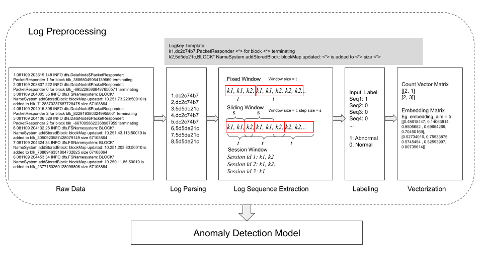

# LogBERT: Log Anomaly Detection via BERT
### [ARXIV](https://arxiv.org/abs/2103.04475) 


This repository provides the implementation of Logbert for log anomaly detection. 
The process includes downloading raw data online, parsing logs into structured data, 
creating log sequences and finally modeling. 



## Configuration
- Ubuntu 20.04
- NVIDIA driver 460.73.01 
- CUDA 11.2
- Python 3.8
- PyTorch 1.9.0

  

## Installation
This code requires the packages listed in requirements.txt.
An virtual environment is recommended to run this code

On macOS and Linux:  
```
python3 -m pip install --user virtualenv
python3 -m venv env
source env/bin/activate
pip install -r requirements.txt
deactivate
```
Reference: https://packaging.python.org/guides/installing-using-pip-and-virtual-environments/

## Experiment
Logbert and other baseline models are implemented on [HDFS](https://github.com/logpai/loghub/tree/master/HDFS), [BGL](https://github.com/logpai/loghub/tree/master/BGL), and [thunderbird]() datasets

 ### HDFS example
 ```shell script
cd scripts

#download 2000 hdfs samples for testing and debugging
sh download_hdfs_2k.sh

#download hdfs dataset
sh download_hdfs.sh


#run logbert on HDFS
sh run_logbert_hdfs.sh


#run deeplog on HDFS
sh run_logdeep_hdfs.sh

#run loganomaly on HDFS by setting the corresponding parameters
sh run_logdeep_hdfs.sh

#run baselines

sh run_loglizer_hdfs.sh
```


## Docker Implementation
### How to use docker with NVIDIA GPU

1. Type ```nvidia-smi```  and check NVIDIA driver and  CUDA version

2. Set up NVIDIA Container Toolkit following this [tutorial](https://docs.nvidia.com/datacenter/cloud-native/container-toolkit/install-guide.html)

3. Refer [this](https://docs.nvidia.com/datacenter/cloud-native/container-toolkit/user-guide.html#id2) to set up parameters for docker with NVIDIA GPU

### 1. Use image published on docker hub
```shell script
docker pull haixuanguo/logbert:1.0

docker run --gpus all -it haixuanguo/logbert:1.0

```

### 2. Create your own docker image
```shell script
docker build -t logbert:1.1 .

docker run --gpus all -it haixuanguo/logbert:1.1

```


